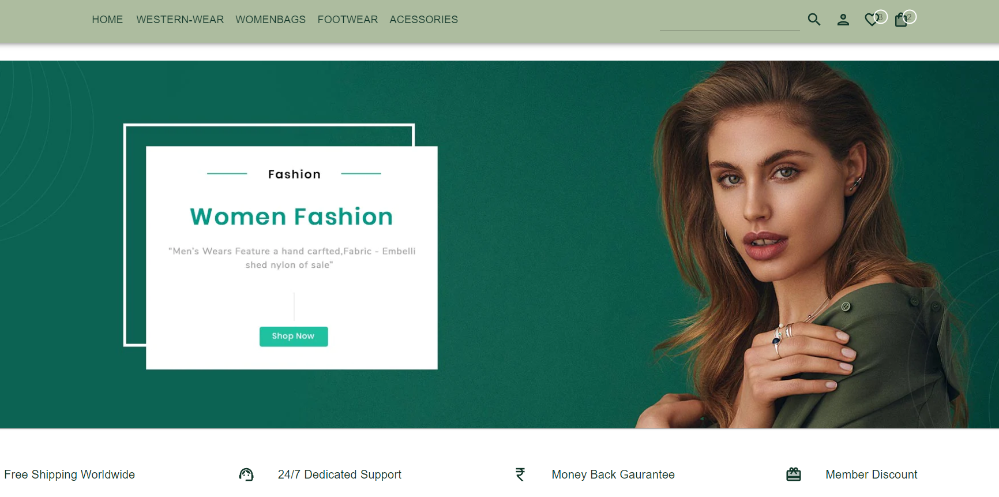
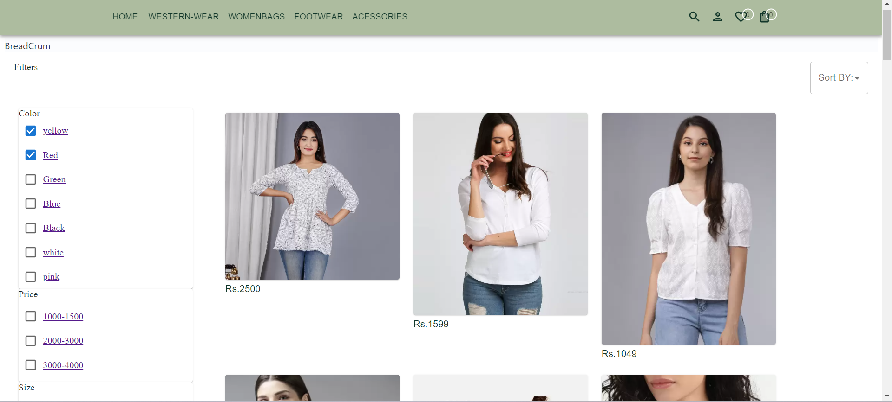
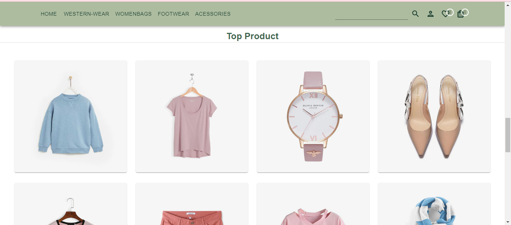
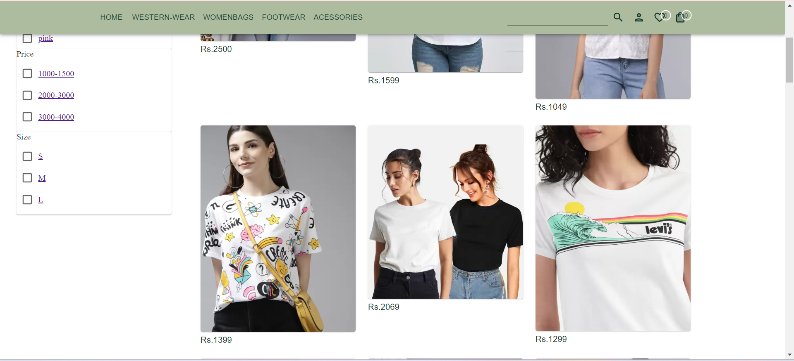
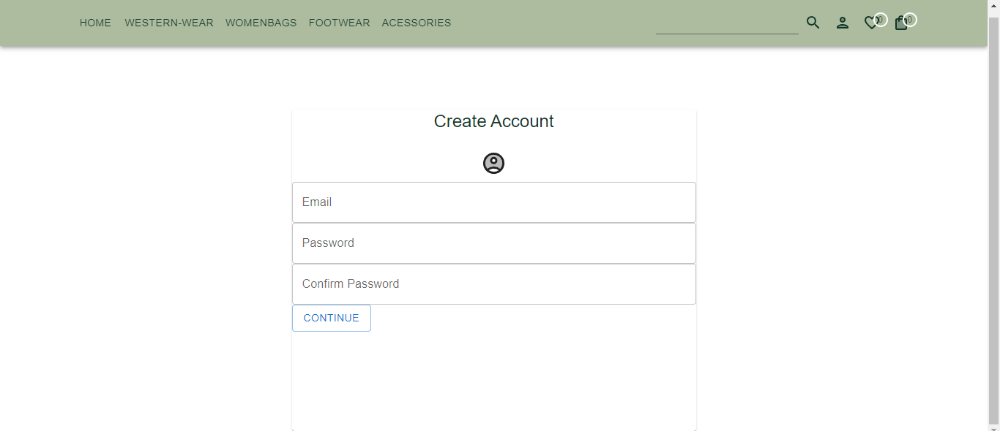

## 🛒 E-Commerce Store

A full-stack e-commerce platform built using ReactJS and Material UI on the frontend, with a secure Express.js and Node.js backend. The application allows users to sign up, sign in with JWT authentication, browse products, sort and filter them, and view detailed product information.

## 🖼️ Screenshot 










## ✨ Features

### Frontend (ReactJS & Material UI):
### User Authentication:
Sign up and sign in functionality with JWT-based authentication.
Validation for user input during login and registration.

### Product Listings:
Display all products with the ability to sort by price, rating, or other criteria.
Filter products based on categories, price ranges, or custom filters.

### Product Details:
View detailed product information, including images, prices, descriptions, and ratings.

### Modern UI:
Responsive, sleek, and user-friendly design built with Material UI for an enhanced user experience.

### Backend (ExpressJS & NodeJS):

### API Endpoints:
Serve product data, including filtering and sorting capabilities from the backend.

### JWT Authentication:
Secure authentication using JSON Web Tokens to protect user data and routes.

### Data Handling:
Manage products, users, and authentication through a MongoDB (or your preferred database solution).

 ### 🛠️ Tech Stack
### Frontend:

ReactJS: Component-based architecture for building a dynamic and responsive user interface.
Material UI: Pre-built components for a clean and modern UI/UX.
Vite: Fast build tool for optimized frontend development.

### Backend:

Node.js & Express.js: REST API to handle requests, user authentication, and serve product data.
Authentication: JWT for secure login, sign-up, and route protection.

Database: MongoDB (or any database of your choice).

### 🧑‍💻 Installation
 ### Clone the repository:
```bash
git clone https://github.com/nandinikashyap1902/Ecommerce_Store.git
cd Ecommerce_Store
```

### Backend Setup:
### Navigate to the backend directory:
```bash
cd E-commerceBackend
npm install
```

### Set up environment variables (.env):
PORT=5000
JWT_SECRET=your_jwt_secret
MONGO_URI=your_mongodb_uri

### Run the backend:
npm start

### Frontend Setup:
### Navigate to the frontend directory:
cd E-commerce frondEnd
npm install

### Start the frontend using Vite:
npm run dev

### Run the application:
Frontend: http://localhost:3000
Backend API: http://localhost:5000

### 🤝 Contributing
Feel free to contribute to this project. Follow the guidelines in CONTRIBUTING.md.

## ✨ Don't forget to give this project a star if you found it useful! ✨
